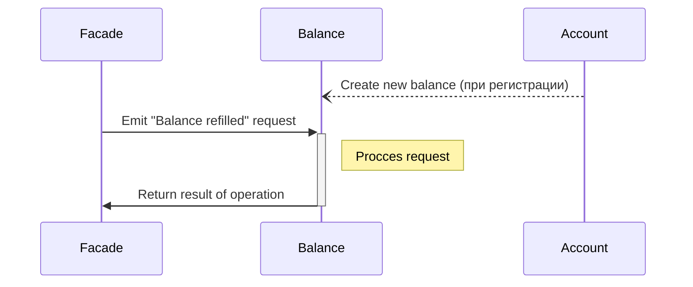

# 2.4 Пополнение демо-счёта из аккаунта

Дата: 2022-07-18

## Статус: PROPOSED

## Требование

### Необходимо реализовать возможность пополнения счета из аккаунта.
1. Система перенаправляет пользователя на форму пополнения счета. Форма содержит поле - сумма пополнения
2. Пользователь вводит необходимое ему количество монет. (Пользователь может бесконечно много раз пополнять демо-счет)
3. Система валидирует данные формы: количество монет (положительное число с двумя знаками после запятой)
4. Пользователь нажимает на кнопку ‘Пополнить’
5. Система отправляет запрос на выдачу средств и записывает данную операцию при удачном пополнении счета.
6. Система уведомляет пользователя о пополнении демо-счета

[Ссылка на исходный документ > 2.4](https://docs.google.com/document/d/1HwW4-Q8kIadQPA3vRosXDwSpWbfjIRJMwdgL5OhvnXY/edit#bookmark=id.j5hh0iuxkkrt)

## Решение

Реализовать микросервис для работы с балансами пользователей.

### Порядок передачи сообщений

Запрос, приходящий с Facade, будет обращаться напрямую к сервису баланса через gRPC, проверять совершалась ли данная операция ранее, проверяя массив транзакций в базе данных, если нет, то изменять баланс, сохранять данные о транзакции и возвращать статус транзакции (OK/Exception).


### Выдача уникального id транзакции
- (ВЫБРАННЫЙ) Отдельный метод в Facade для генерации id.
  + (+) надежность;
  + (+) один источник правды;
  + (+) сами генерируем id;
  + (-) дополнительная нагрузка на Facade;
  + (-) не до конца понятно как реализовать;

#### Альтернативные варианты:
- Выдавать уникальный на front-end.
  + (+) нет необходимости дополнительного взаимодействия с сервером;
  + (+) мгновенная отправка данных;
  + (-) перенос ответственности на front-end;
- Ручной ввод клиентом.
  + (+) удобно для ручного тестирования;
  + (+) мы ничего не делаем;
  + (-) утомительно для клиента;
  + (-) возможны коллизии;
- Возвращать длину массива с информацией о транзакциях.
  + (+) простота;
  + (-) дополнительный запрос на микросервис;
  + (-) при высокой задержке id может часто быть не актуальным;

### Формат хранения баланса в базе данных

- Храним монеты целыми числами, для нормального хранения "копеек", чтобы избежать неточностей в операциях с double.

- Храним информацию о совершенных транзакциях;

- Баланс так же хранит id пользователя, чтобы по нему производить поиск.

- Новый баланс создается при регистрации пользователя автоматически.

```ts
Balance {
  total: number;
  userId: string;
  transanctions: transaction[];
}
```

```ts
Transaction {
  transactionId: string,
  refillSum: number,
  transactionTime: Date
}
```

- Принимаем транзакцию, находим необходимый баланс. Если такая транзакция еще не производилась, то атоамрно производим транзакцию: в БД прибавляем сумму для пополнения в поле total. Добавляем информацию о последней транзакции в массив транзакций.

- Время проведения транзакции или обновления будет автоматически генерироваться mongoDB.

### Формат передачи данных о транзакции

- (ВЫБРАННЫЙ) Вариант передачи обработанного числа в целочисленное значение.
  + (+) простота реализации;
  + (+) скорость выполнения операций;
  + (-) возможны проблемы при работе с валютами с разной дробной частью;
  + (-) возможно переполнение;

Формат передачи (идентичен для Facade):
```proto3
message RefillBalanceRequest {
  string user_id = 1;
  string transaction_id = 2;
  uint64 refill_sum = 3;
}
```

#### Альтернативные варианты:
- Вариант передачи числа в изначальном виде (double), обрабатываем в самом сервисе.
  + (+) нет необходимости обрабатывать на Facade;
  + (-) возможна потеря точности;
- Вариант передачи обработанного числа в объекте с двумя целочисленными полями. (либо просто двумя полями) 
  + (+) высокая надежность;
  + (+) возможность представления разных валют;
  + (-) более сложная реализация;
- Вариант передачи обработанного числа в формате Decimal.
  + (+) высокая надежность;
  + (-) лишняя зависимость;
  + (-) не факт, что реализация библиотеки оптимальна под наши нужды;
<!-- - Bigint
- Свой тип данных -->

### Формат передачи данных с состоянием баланса
- (ВЫБРАННЫЙ) При успешном проведении операции возвращается статус 0.
- Так как операция идемпотентна, то при повторном запросе так же получим статус 0.
- В случае неудачи получаем ошибку с кратким описанием проблемы (с не чувствительной для безопасности информацией)

Формат передачи:
```proto3
message GetBalanceResponse {
  int32 status = 1;
}
```

#### Альтернативные варианты:
- При необходимости конвертации данных для большинства других сервисов, возможен переход на другой формат возвращаемых данных;
<!-- 
### Варианты хранения транзакций
- (ОСНОВНОЙ) Хранить все транзакции в kafka (kafka хранит сколько угодно операций сколько угодно большой промежуток времени).
- Хранить транзакции на отдельном сервисе. (Перегруженный вариант. Есть необходимость только в том случае, если будет происходить большое количество операций непосредственно с историей транзакций, возможно дополнительная обработка. И kafka при этом все данные **не** хранит) -->

## Заключение
При написании ADR руководствовались простотой и понятностью реализации. Оставляя возможность для изменения в реализации при необходимости.