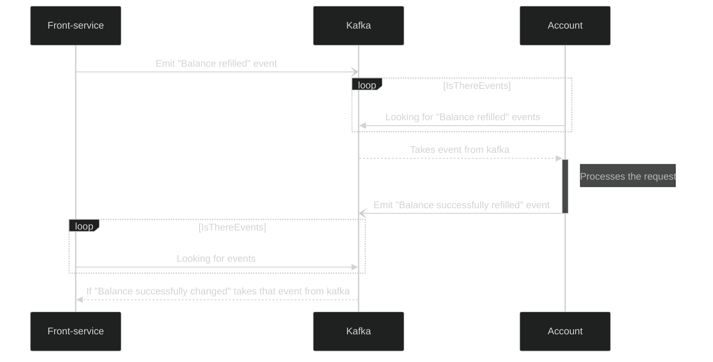

# 2.4 Пополнение демо-счёта из аккаунта

Дата: 2022-07-13

## Статус: PROPOSED

## Требование

### Необходимо реализовать возможность пополнения счета из аккаунта.
1. Система перенаправляет пользователя на форму пополнения счета. Форма содержит поле - сумма пополнения
2. Пользователь вводит необходимое ему количество монет. (Пользователь может бесконечно много раз пополнять демо-счет)
3. Система валидирует данные формы: количество монет (положительное число с двумя знаками после запятой)
4. Пользователь нажимает на кнопку ‘Пополнить’
5. Система отправляет запрос на выдачу средств и записывает данную операцию при удачном пополнении счета.
6. Система уведомляет пользователя о пополнении демо-счета

[Ссылка на исходный документ > 2.4](https://docs.google.com/document/d/1HwW4-Q8kIadQPA3vRosXDwSpWbfjIRJMwdgL5OhvnXY/edit#bookmark=id.j5hh0iuxkkrt)

## Решение

Реализовать микросервис для работы с балансами пользователей.

### Порядок передачи сообщений



### Храним балансы в базе данных на отдельном микросервисе

- Храним монеты целыми числами, для нормального хранения"копеек", чтобы избежать неточностей в операциях с double.
- Баланс ничего не обязан знать о владельце, ссылка (id_account) должен храниться у пльзователя.
```
Account {
  "total": number;
}
```
- Читаем последнюю транзакцию по событию, пересчитываем общую сумму и сохраняем в БД в поле total.

- Так как транзакции не требуют мгновенной обработки операции, а все балансы хранятся на одном микросервисе, сервис с балансами, по приходу сигнала, будет обрабатывать сумму поплнения и прибавлять ее к общей сумме, которую мы храним. Затем возвращать в kafka событие "баланс пополнен".
- Дополнительная синхронизация не требуется.  Хватит семантики доставки сообщений **at-most-once**, т.к. поплнений может быть несколько, exactly-once это overkill, а дублирование в случае с балансом - это плохо, так что at-least-once = не лучшее решение.
 
### Формат према данных о пополнении

- (ВЫБРАННЫЙ) вариант передачи числа в изначальном виде, обрабатываем в самом сервисе. (нет необходимости обрабатывать на front)
```proto3
message TopUpAccount {
  string account_id = 1;
  double refillSum = 2;
}
```
#### Альтернативные варианты:
- Вариант передачи обработанного числа в целочисленное знасчение. (Работаем сразу с хранимым форматом)
```proto3
message TopUpAccount {
  string account_id = 1;
  uint64 refillSum = 2;
}
```

### Формат возвращаемых данных с результатом пополнения
- (ВЫБРАННЫЙ) Вариант передачи обработанного числа в формате double. (нет необходимости обрабатывать на front)
```proto3
message TopUpAccountSucces {
  string account_id = 1;
  double total = 2;
}
```
#### Альтернативные варианты:
- Вариант передачи числа в изначальном виде, обрабатываем в самом сервисе. (Дополнительные действия при выводе на front)
```proto3
message TopUpAccountSucces {
  string account_id = 1;
  uint64 total = 2;
}
```
- Вариант передачи обработанного числа в формат string. (нет необходимости обрабатывать на front, выводим сразу как строку)
```proto3
message TopUpAccountSucces {
  string account_id = 1;
  string total = 2;
}
```

### Варианты хранения транзакций
- (ОСНОВНОЙ) Хранить все транзакции в kafka (kafka хранит сколько угодно операций сколько угодно большой промежуток времени).

#### Альтернативные варианты:
- Хранить все операции с конкретным счетом массиве в БД в самом счете пользователя. (Может быть удобно в будущем для вывода истории транзакций, хранения статуса счета и тд.)
- Хранить транзакции на отдельном сервисе. (Перегруженный вариант. Есть необходимость только в том случае, если будет происходить большое количество операций непосредственно с историей транзакций, возможно дополнительная обработка. И kafka при этом все данные **не** хранит)

## Заключение
Выбран формат хранения в базе данных, формат передачи данных через gRPC, семантика передачи сообщений, формат хранения транзакций, формат получаемых и возвращаемых данных.

### Плюсы:
- Избегаем потери точности при хранении средств в целочисленном формате.
- В каком формате получаем данные, в таком и возвращаем.
- Доставка события меньше нагружает сервис, операция не критична для работы биржи.

### Минусы:
- Необходимо соблюдать консистентность в хранении и обработке целочисленных данных о балансе, учитывать при передаче данных между сервисами.
- При приведении uint64 -> double при очень больших значениях (bigint), могут быть проблемы, возможна необходимость дополнительных проверок, шагов для привидения.
- Необходима "привязка" счета к аккаунту при создании этого самого счета (с учетом того, что их может быть несколько у одного аккаунта). Либо же создавать счет непосредственно вместе с аккаунтом. Т.к. счету не обязательно знать о том, какому аккаунту он пренадлежит.
- Могут быть потери события при доставке.