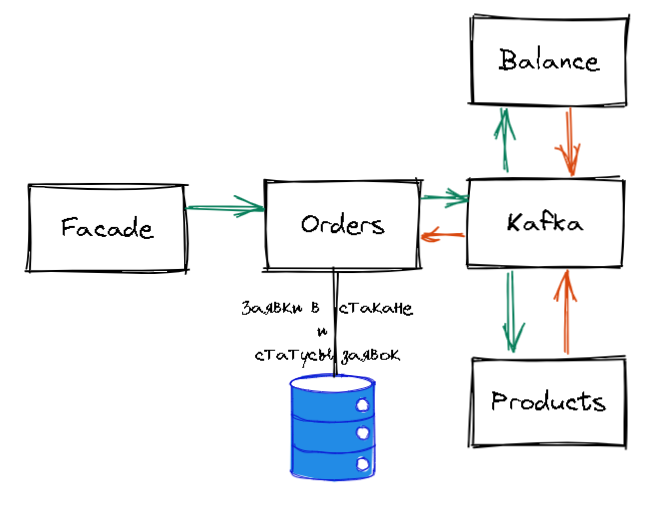
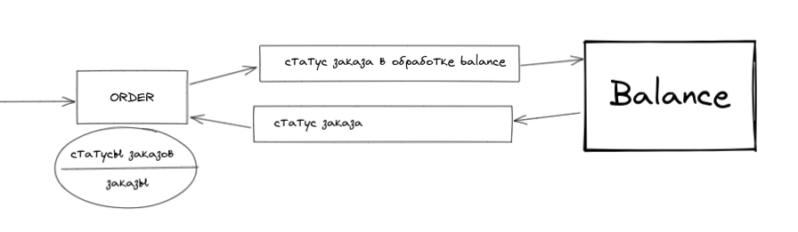
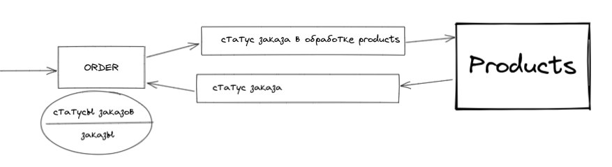

# 2.4 Пополнение демо-счёта из аккаунта

Дата: 2022-08-08

## Статус: PROPOSED

## Требование

### Создание заявки на продажу товара
1. Система перенаправляет пользователя на форму создания заявки. Форма содержит поля - наименование товара, количество, цена
2. Пользователь вводит наименование товара, количество, цену. В заявке пользователь может ставить или не ставить галочку напротив ‘Продать всё сразу, либо не совершать сделку’
3. Система валидирует данные формы: наименование товара (кириллица/латиница, возможен разный регистр, цифры тоже допустимы; в портфеле пользователя имеется данный товар),  цена (положительное число с двумя знаками после запятой), количество (положительное целое число)
4. Система рассчитывает размер комиссии (1% от цены) и отображает ее в заявке пользователя
5. Пользователь нажимает кнопку ‘Отправить заявку’
6. Система создаёт заявку, внося ее в базу данных - заявка отображается в списке личных заявок и в общем списке заявок (в стакане) 
7. Система уведомляет пользователя о созданной заявке

[Ссылка на исходный документ > 2.3.1, 2.3.2](https://docs.google.com/document/d/1HwW4-Q8kIadQPA3vRosXDwSpWbfjIRJMwdgL5OhvnXY/edit#bookmark=id.j5hh0iuxkkrt)

## Решение



Реализовать микросервис для работы с заявками на покупку и продажу. Он будет взаимодействовать с другими сервисами через Kafka.

!Решения в основном принимались такие, чтобы была возможность попробовать новые технологии, написать работоспособный код, который будет удовлетворять MVP.!

### Порядок передачи сообщений

Запрос асинхронный и просто принимает заявку.

Часть проверок (например баланс, товары, которым торгуют) отдаем фронтенду. Поможет измежать большинства ошибок при заполнении формы, ограничение по балансу (фронтенд принимает баланс и не дает поставить сумму больше полученной, так же с продуктами). Остается проблема с товаром, который может быть распродан, но это надо сделать в следующей итерации.

Перед отправкой запроса будет получен уникальный id, который будет генерироваться на фасаде специальным методом.
Запрос, приходящий с Facade, будет обращаться напрямую к сервису заявок через gRPC, проверять имеется ли данный заказ, проверяя id заказа в базе данных, если такого нет, то создаем в базе данных (статусы заказов) новую запись. Далее обработкой занимается сам сервис.

## Передача сообщений

### Формат хранения заявок в базе данных

```ts
enum OrderStatus { // isDone: bool; 
  processing;
  done;
}

enum OrderType { // isForSell: bool;
  buy;
  sell;
}

// как сделать так, чтобы пользователь знал об отклоненных заявках?
// надо ли хранить отклоненные в течении какого-то времени? Если да, то где хранить информацию о нем? Сразу в том же месте?
// много вопросов об избежании дублирования и едином доступе при горизонтальном масштабировании, не создавя для этого отдельный сервис
OrderStatus {
  orderId: string;
  userId: string;
 // нужно ли это поле, если мы просто удляем выполненные и отклоненные заказы из этого списка?
  status: OrderStatus;// isDone: bool; 
  createdAt: Date;
}

// для торгов и отображения не выполненных заявок
// храним только обработанные заявки (с уже замороженными данными)
Order {
  transactionId: string; // idempotency
  userId: string;
  product: string;
  quantity: number;
  cost: number;
  orderType: OrderType; // isForSell: bool;
}
```

Храним заказы сразу со статусом в одной коллекции, а вся информация перемещается в историю уже после сделки.

### Формат передачи данных о транзакции

- Передаем тип заказа как enum
  + (+) Проще для понимания.
  + (-) Чуть сложнее для реализации. 
  + (-) Придется парсить строку.

- Передеаем тип заказа как булево значение
  + (+) Просто.
  + (-) Не до конца понятно, сложнее для расширения. (какого?)

Формат передачи (идентичен для Facade)
```proto3
message OrderRequest {
  string order_id = 1;
  string user_id = 2;
  string product = 3;
  int32 quantity = 4;
  int64 cost = 5;
  string order_type = 6; // bool isForSell;
}
```

### Формат ответа с состоянием подачи заявки
- При успешной заявке возвращается статус 0.
- Так как операция идемпотентна, то при повторном запросе так же получим статус 0.

Формат передачи:
```proto3
message OrderResponse {
  int32 status = 1;
}
```

## Альтернатива

Делать это синхронно и возвращать итоговое состоянии заявки. Была ли она передана в стакан, либо же заявка была отклонена.
(+) заметно проще и понятнее
(-) заметно медленнее

## Обработка заявок

Сообщения в кафке будут передаваться с изначальным сообщением, чтобы не надо было дополнительно хранить данные.

### Заявка на покупку



Отправляем заявку в очередь "статус заказа в обработке балансом".

Баланс получает заявку и проверяет имеется ли необходимая сумма у пользователя.
Если да, то "замораживает" необходимую сумму - перемещает ее в поле frozen.
Отправляет статус операции в балансе в кафку "статус заявки".

Микросервис заявок проверяет статус операции в балансе. Если средств не хватило и операция не произошла, тогда удаляет заявку из коллекции текущих заявок.
Иначе складываем заявку в "стакан".

### Заявка на продажу



Отправляем заявку в очередь "статус заказа в обработке продуктами пользователя".

Сервис продуктов получает заявку и проверяет имеется необходимый товар нужном количестве у пользователя.
Если да, то "замораживает" необходимое колчество - перемещает их в массив frozen.
Отправляет статус операции в продутах пользователся в кафку "статус заявки".

Микросервис заявок проверяет статус операции в продутах пользователся. Если продуктов не хватило и операция не произошла, тогда удаляет заявку из коллекции текущих заявок.
Иначе складываем заявку в "стакан".

## Заключение

При написании ADR возникли новые вопросы, которые нужно проработать и принять решение. Основным решением оставляем самое простое решение чреез кафку, но для юзера оно будет наименее дружелюбно, возможно частично непонятно.