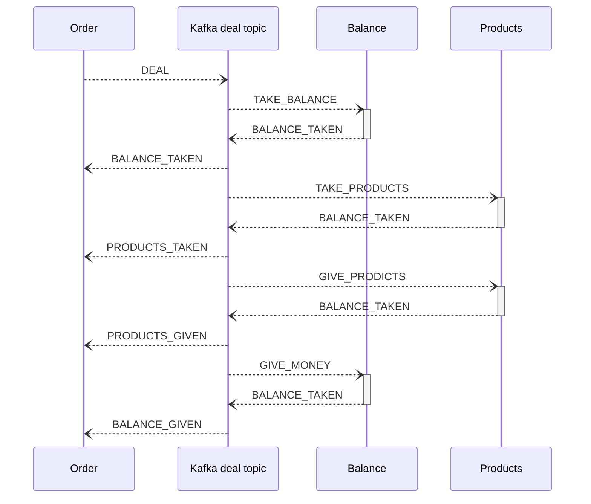

# 3.1 Создание заявки на покупку и продажу товаров пользователем.

Дата: 2022-08-17

## Статус: PROPOSED

## Требование

### Оформление сделки
1. Сделка совершается автоматически, когда найдена заявка на продажу и заявка на покупку с одинаковыми условиями: наименование товара, цена.
2. Во время сделки биржа получает 1% (разработчик может менять размер комиссии) от прибыли.
3. Если несколько заявок подходят по условиям, то сделка совершается с тем пользователем, который опубликовал заявку первым.
4. Если пользователь хочет удовлетворить условия в заявле полностью одной сделкой, то он может поставить галочку напротив ‘Продать всё сразу, либо не совершать сделку’ или ‘Купить всё сразу, либо не совершать сделку’ (Сделаем сначала закрытие полных сделок, ибо они немного проще.)
5. Также сделка может удовлетворяться частично разными пользователями при покупке/продаже товара одного наименования, при этом автоматически изменяется количество товара в заявке. Пример 1: пользователь хочет купить 100уе товара, другой пользователь может продать 20уе такого же товара, тогда сделка совершается, и в заявке на покупку изменяется объем товара на 80уе. Пример 2: пользователь хочет продать 100уе товара, другой пользователь хочет купить только 40уе такого же товара, тогда сделка совершается, и в заявке на продажу объем товара меняется 60уе.

[Ссылка на исходный документ > 3.1-3.3](https://docs.google.com/document/d/1HwW4-Q8kIadQPA3vRosXDwSpWbfjIRJMwdgL5OhvnXY/edit#bookmark=id.sgjzva4uipp9)

## Решение

Реализовать функционал для свершения сделок. Он будет реализован как часть микросервиса заявок.
При свершении сделки заявки удаляются из стакана и добавляются в коллекцию БД, в которой будут храниться документы со сделками.

Один документ - две заявки и статусы совершения сделки. Отправляем ивент о том, что совершается сделка и ждем все 4 неободимых ответа. 
Если нет хотя бы одного, то надо откатывать коммит.
Добавить ожидания соверщения всех операций, условно, 5-10 секунд.
(реализация после основного функционала).

Создание заявки (на этапе до сделки) также замораживало средства, необходимые для сделки, соответственно, это была первая фаза 2PC. Далее производим вторую, завершающую фазу с передачей средств.

Единственная возможная проблема - когда сервис сделал какую-то операцию, но упал до того, как успел отправить в кафку обратно сообщение. (не очень понятно как с этим бороться, но есть вариант с очередным id транзакции, которые везде придется хранить дополнительно, тяжелый и, наверное, долги вариант). 

```js
enum DealStatusEnum: {
  BALANCE_TAKEN = 0,
  PRODUCT_TAKEN = 1,
  PRODUCT_GIVEN = 2,
  BALANCE_GIVEN = 3,
  DONE = 4,
}

// mongo
enum Deal: {
  balanceTaken: bool;
  productTaken: bool;
  productGiven: bool;
  BALANCE_GIVEN: bool;
  sellOrder: Order;
  buyOrder: Order;
}
```

### Порядок передачи сообщений



Каждый раз, когда мы публикуем заявку, мы смотрим на наличие подходящих\более выгодных заявок противоположного типа.
Если такие есть, выбираем заявку с самой ранней датой.
Теперь можно начинать транзакцию:
1. Удаляем из стакана заявку с которой сошлись. А новая заявка попадает в сделку.
2. Пишем в кафку сообщение содержащее данные о товаре и денежных средствах.
3. Сервисы продуктов читают сообщения и применяют изменения у себя.
Если на каком то этапе что то пошло не так, то откатываемся назад с помощью 2pc.

Также необходимо предусмотреть систему вычета % и возврата части денежных средств если противоположная заявка оказалась более выгодной.
## Взятие % за сделку

Со стороны сервера не так важно на каком этапе мы возьмем наш % и кто его увидит. По сути в любом случае мы предполагаем некий внешний источник запросов, который при создании заявки будет видеть расчеты процента у себя. (если фронтенд), или отправлять уже предположительно просчитанное значение (например Postman).

## Альтернатива

Мы могли бы реализовать сделки как отдельный микросервис, но микросервис с одним методом кажется перебором. (если не считать метод чтения истории свершения сделок)
На время свершения операции необходимо будет снижать количество/скрывать зявки в стакане.
## Заключение

Здесь был описан механизм свершения сделок.